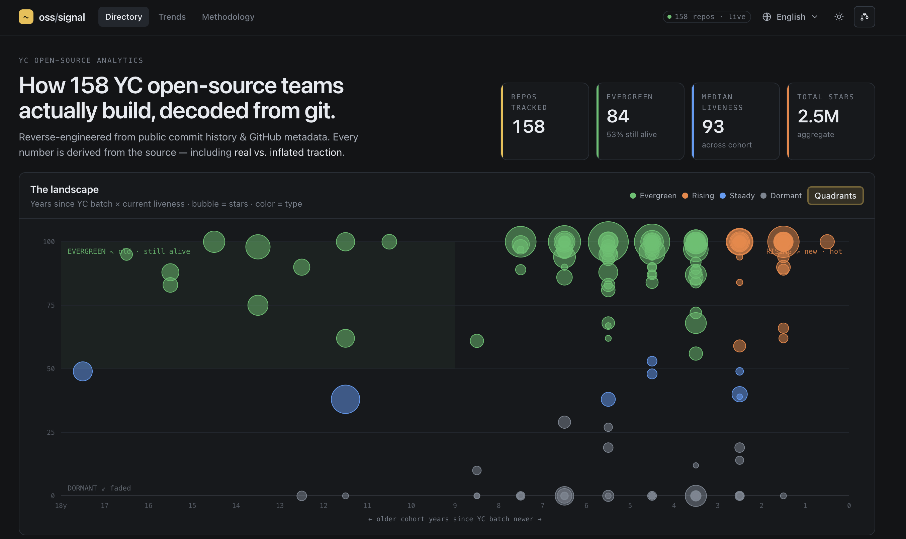

# oss/signal — YC Open Source Analytics

[](https://yc-oss-analytics.pages.dev)
[](LICENSE)
[](https://astro.build)
[](.github/workflows/update.yml)

How Y Combinator open-source teams *actually* build — work intensity, tech stack, and
workflow, reconstructed from their public git history and GitHub metadata.

**▸ Live: [yc-oss-analytics.pages.dev](https://yc-oss-analytics.pages.dev)**

[](https://yc-oss-analytics.pages.dev)

> **Not affiliated with Y Combinator.** This is an independent, best-effort analysis of
> *public* data. Every number here is an approximation with known caveats — see
> [Assumptions & limitations](#assumptions--limitations). If you find an error, please
> open an issue.

---

## What this is

A reproducible pipeline + static site that, for each open-source YC company:

- measures **work intensity** (commit cadence, punch-card, weekend share, AI-assist rate),
- detects the **tech stack** (languages, package manager, dependencies, infra/tooling),
- summarizes the **workflow** (conventional-commit usage, PR-merge share, message style),
- scores **activity / liveness** now, and cross-references it with the company's YC batch age,
- reconstructs **star growth** and flags anomalies.

The goal is learning — what durable, high-velocity open-source teams do — not ranking or
judging anyone.

---

## Data sources & provenance

| Source | Used for | Notes |
|---|---|---|
| [`yc-oss/api`](https://github.com/yc-oss/api) (`companies/all.json`, `tags/open-source.json`) | YC company universe + metadata (batch, status, website, team size) | Community dataset scraped from the **public** YC directory. Updated daily. |
| [`yc-oss/open-source-companies`](https://github.com/yc-oss/open-source-companies) (`repositories.json`) | YC company → primary GitHub repo mapping + headline stars/forks | Derived from the `open-source` tag (see false-negative caveat below). |
| **GitHub REST API** | repo metadata, languages, manifests, stargazer timestamps | Authenticated, cached. |
| **Git history** (blobless or full clone) | commit timestamps, authors, messages, churn | We clone, analyze, and discard. We do not redistribute repo contents. |

---

## How each metric is computed

All commit-level analysis **excludes merge commits** unless stated.

### Work intensity
- **Commits/week** = non-merge commits ÷ (active span in days) × 7. "Active span" = first→last
  commit date, so a repo with a long idle gap shows a *lower* average than its busy periods.
- **Punch card** = commit counts bucketed by weekday × hour, in the **commit's own timezone
  offset** as recorded in git. (See timezone caveat.)
- **Weekend share** = % of commits on Sat/Sun (author-local).
- **AI-assist rate** = commits whose message contains a `Co-Authored-By: Claude` trailer.
  This is a **lower bound** — it only catches tools that write that trailer, and only when
  authors keep it.

### Activity / liveness
- **`commits_90d` / `30d` / `365d`** = non-merge commits within N days of the **crawl date**
  (not "today" when you read the site — see freshness caveat).
- **`liveness`** (0–100) = `55 × recency + 45 × volume`, where
  `recency = max(0, 1 − days_since_last_commit / 365)` and
  `volume = min(1, log10(commits_90d + 1) / log10(300))`.
  This is a **heuristic we picked**, not a validated index. Weights are deliberately simple
  and may change; treat it as ordinal, not absolute.
- **Classification** crosses liveness with batch age:
  - `evergreen` — batch ≥ 3y old **and** liveness ≥ 55 (old but still very active),
  - `rising` — batch < 3y **and** liveness ≥ 55,
  - `dormant` — liveness < 30,
  - `steady` — everything else.

### Workflow
- **Conventional-commit %** = share of subjects matching `^type(scope)?!?:`.
- **PR-merge share** = merge commits ÷ all commits (proxy for a PR-based workflow; squash
  merges don't create merge commits, so this **undercounts** squash-heavy teams).

### Stars
- **Growth curve** = `starred_at` timestamps from the GitHub stargazers API.
  - For repos **under ~40k stars** we can fetch every star → an exact daily curve.
  - The API is **capped at ~400 pages (40k stars)**; for larger repos we currently **sample**
    pages, so the curve is piecewise-linear between sampled points, and we cannot see recent
    stars of very large repos via this endpoint (we'll move those to GH Archive — see roadmap).
- **Viral window** = the 30-day span with the largest star gain. Heuristic, sample-resolution.

### Churn (full-tier repos only)
- Per-month lines added/deleted via `git log --numstat`. Computed **only for fully cloned
  repos**; blobless clones skip it (numstat would force-download every blob). Lock files,
  generated code, and vendored assets inflate these numbers and are **not** filtered yet.

---

## Assumptions & limitations

We'd rather under-claim. Known issues, roughly by impact:

1. **Author identity is email-based.** One person using multiple emails is counted as multiple
   contributors; shared/bot emails merge people. Contributor counts are approximate.
2. **Timezones are whatever git recorded.** The punch card reflects the *committing machine's*
   offset, which can be wrong (CI, rebases, travel, misconfigured clocks). Read "night/weekend"
   patterns as suggestive, not forensic.
3. **`liveness` and the class thresholds are heuristics**, not validated against any ground
   truth. They exist to sort and surface patterns, not to grade teams.
4. **"Now" means the crawl date.** Activity numbers reflect when the pipeline last ran (shown
   on the site), not the moment you load the page.
5. **The YC "Open Source" tag has false negatives.** Some genuinely open-source YC companies
   aren't tagged on the YC site (their tag list is empty) and are therefore missing from the
   upstream dataset entirely. We patch known cases via [`overrides/`](overrides/) and are
   building a verification-based discovery pass; coverage is **not** complete.
6. **Star curves are sampled for large repos** and cannot be perfectly backfilled. The
   stargazers API also reflects GitHub's *current* stargazers — stars later removed (or purged
   by GitHub) don't appear, which can hide historical manipulation.
7. **Churn is partial and noisy** (full-tier repos only; lock/generated files not excluded).
8. **Merge-commit exclusion** changes counts; squash-merge workflows look different from
   merge-commit workflows even at identical activity.
9. **Bots are included** unless explicitly filtered; some repos have significant bot commits.

### Reading the star-growth story

We're curious about *how* a project's stars accumulated — the shape and sources of its growth —
not about policing whether they're "real". Every signal here is a **descriptive lens on the
growth story**, never a verdict. A star curve's shape usually points to one of a few very
different, all-legitimate paths:

- **Steady organic growth** — a long, compounding climb as more people discover and use the
  project.
- **Event-driven spikes** — a sharp jump tied to a moment: a YC Launch, a Show HN, a Product
  Hunt launch, an HN front page, a well-timed tweet, or a large project adopting it as a
  dependency.
- **Alumni / network amplification** — early stars from the YC orbit (developers who also star
  other YC repos). A real and valuable boost — a network effect rather than cold-start
  discovery.

Surfacing *which path* a project took is the interesting part — for a founder studying launch
tactics, that's far more useful than any single number. The network signal is derived
structurally from cross-starring within the YC repo set; we do **not** maintain a roster of
individuals, publish personal data, or label any project as fake or fraudulent.

---

## Reproducibility

```bash
# 0. fetch upstream yc-oss datasets (regenerable caches, not committed)
bash pipeline/fetch_sources.sh

# 1. build the ranked candidate list (yc-oss datasets + manual overrides)
python3 pipeline/build_candidates.py

# 2a. analyze one repo -> data/repos/<slug>.json
python3 pipeline/run.py <slug> <owner/repo> [--full] [--stars] [--cleanup]

# 2b. or analyze everything tracked, disk-safely (one clone at a time, deleted after)
python3 pipeline/bulk.py [--no-stars] [N]

# 3. maintain the registry: detect companies that appeared / disappeared upstream
python3 pipeline/update.py

# 4. (optional) recover open-source companies the YC tag missed (link-verified review queue)
python3 pipeline/discover.py [N | --all]

# 5. site
cd web && pnpm install && pnpm dev
```

`--full` does a full clone (enables churn); default is a blobless clone (cheaper, metadata
only). `--stars` reconstructs the star curve (API-heavy). `--cleanup` deletes the clone after
analysis — `bulk.py` uses it so hundreds of repos never pile up on disk.

## GitHub API rate limits — and how we respect them

We treat GitHub's limits as a hard contract, not a suggestion.

**The limits** (REST, as enforced at time of writing):

| Resource | Authenticated | Unauthenticated |
|---|---|---|
| Core (most endpoints) | **5,000 req/hour** | 60 req/hour (per IP) |
| Search | 30 req/min | 10 req/min |
| GraphQL | 5,000 points/hour | n/a |

Plus **secondary limits** (abuse protection): no aggressive concurrency (keep well under
~100 concurrent / ~900 points/min), and bursts get a `403`/`429` with a `Retry-After` header.
There is also a **pagination ceiling of ~400 pages (≈40k items)** on list endpoints like
stargazers — a hard cap, not a rate limit (see the star-curve caveat).

**What our pipeline does:**

- **Always authenticate** (via `gh`/a token) → 5,000/hr, not 60/hr.
- **Check before spending.** The free `GET /rate_limit` endpoint (it does *not* count against
  the limit) is polled before expensive loops; if `x-ratelimit-remaining` is low we **pause
  until `x-ratelimit-reset`** rather than hammering through 403s.
- **Honor the headers.** We read `x-ratelimit-remaining` / `-reset` on responses and back off
  on `Retry-After` for any secondary-limit `403`/`429`.
- **Low concurrency.** Requests are largely serialized; we don't fan out hundreds of parallel
  calls.
- **Cache aggressively.** Repo metadata is cached; unchanged repos are skipped between runs
  (conditional requests / on-disk cache), so a weekly re-crawl is mostly cache hits.
- **Budget the expensive parts.** Cheap signals cost ~4–5 calls/repo. Star-curve backfill and
  stargazer-account sampling are the costly operations (tens to ~200 calls/repo) and are
  **spread across the weekly cron**, not run all at once. We do not attempt to defeat the
  400-page stargazer ceiling — large repos move to GH Archive instead.

If you run the pipeline yourself, set `GITHUB_TOKEN` (or be logged in via `gh auth login`) and
prefer the scheduled cron over ad-hoc full re-crawls.

## Privacy

We analyze public data and publish **aggregates**. We avoid surfacing raw personal data
(e.g. contributor email addresses); contributor views show display names/handles and counts.
If you want your project corrected or excluded, open an issue.

## Roadmap

- Daily-exact star curves + unbounded history via **GH Archive / OSS Insight** (removes the 40k
  cap and gives per-star actor identity).
- Verification-based **discovery** (scrape company sites for `github.com` links, cross-check org
  domain) to fix the tag false-negative gap at scale.
- **Star-growth-story** module (growth shape, event attribution, alumni/network amplification).

## License & attribution

Analysis code: see [`LICENSE`](LICENSE). Company/repo metadata © their respective owners,
sourced from the public YC directory via `yc-oss`. Not affiliated with or endorsed by Y
Combinator.
